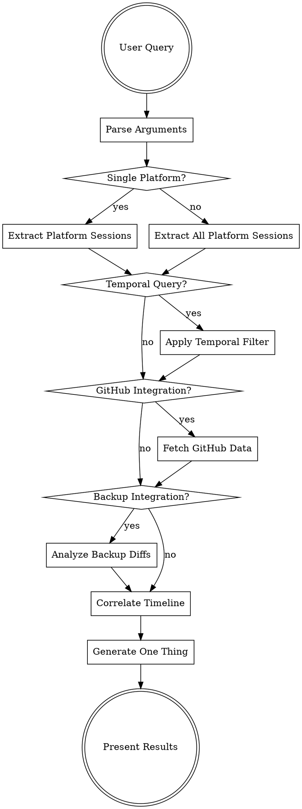

# Multi-Platform Recall Workflow

## Routing Logic



## Step-by-Step Process

### 1. Argument Parsing

```python
def parse_recall_args(args):
    """Parse recall command arguments into structured request."""
    parsed = {
        'platforms': [],
        'date_range': None,
        'topic': None,
        'github_repo': None,
        'backup_path': None,
        'include_github': False,
        'include_backups': False
    }

    for arg in args:
        if arg.startswith('platform:'):
            parsed['platforms'].append(arg.split(':')[1])
        elif arg.startswith('github:'):
            parsed['github_repo'] = arg.split(':')[1]
            parsed['include_github'] = True
        elif arg.startswith('backup:'):
            parsed['backup_path'] = arg.split(':')[1]
            parsed['include_backups'] = True
        elif arg in ['yesterday', 'today', 'last week', 'this week']:
            parsed['date_range'] = resolve_relative_date(arg)
        elif re.match(r'\d{4}-\d{2}-\d{2}', arg):
            parsed['date_range'] = parse_absolute_date(arg)
        else:
            parsed['topic'] = arg

    # Default to all platforms if none specified
    if not parsed['platforms']:
        parsed['platforms'] = ['claude', 'hermes', 'gemini', 'opencode']

    return parsed
```

### 2. Platform Session Extraction

```python
def extract_platform_sessions(platform, date_range, topic):
    """Extract sessions from specific platform."""
    extractors = {
        'claude': extract_claude_sessions,
        'hermes': extract_hermes_sessions,
        'gemini': extract_gemini_sessions,
        'opencode': extract_opencode_sessions
    }

    if platform not in extractors:
        raise ValueError(f"Unsupported platform: {platform}")

    sessions = extractors[platform](date_range)

    if topic:
        sessions = filter_by_topic(sessions, topic)

    return sessions

def extract_claude_sessions(date_range):
    """Extract Claude Code sessions using existing script."""
    cmd = f"python3 scripts/extract-sessions.py --days {date_range['days']}"
    result = subprocess.run(cmd, shell=True, capture_output=True, text=True)
    # Parse JSONL output
    return parse_sessions_jsonl(result.stdout)

def extract_hermes_sessions(date_range):
    """Extract Hermes sessions via CLI export."""
    cmd = "hermes sessions export -"
    result = subprocess.run(cmd, shell=True, capture_output=True, text=True)
    return parse_sessions_jsonl(result.stdout)

def extract_gemini_sessions(date_range):
    """Extract Gemini CLI sessions from config directory."""
    session_dir = os.path.expanduser("~/.config/gemini/sessions/")
    sessions = []

    for file_path in glob.glob(f"{session_dir}/*.json"):
        file_time = os.path.getmtime(file_path)
        if is_in_date_range(file_time, date_range):
            with open(file_path, 'r') as f:
                sessions.append(json.load(f))

    return sessions

def extract_opencode_sessions(date_range):
    """Extract OpenCode sessions from log files."""
    log_dir = os.path.expanduser("~/.config/opencode/logs/")
    sessions = []

    # Find recent log files
    for file_path in glob.glob(f"{log_dir}/*.log"):
        if is_file_in_date_range(file_path, date_range):
            sessions.extend(parse_opencode_logs(file_path))

    return sessions
```

### 3. GitHub Integration

```python
def fetch_github_data(repo, date_range):
    """Fetch GitHub commits and PR activity."""
    since = date_range['start'].isoformat() + 'Z'
    until = date_range['end'].isoformat() + 'Z'

    # Get commits
    commits_cmd = f"""
    gh api repos/{repo}/commits \\
      --method GET \\
      --field since="{since}" \\
      --field until="{until}" \\
      --jq '.[] | {{sha: .sha, message: .commit.message, date: .commit.author.date, author: .commit.author.name}}'
    """

    commits_result = subprocess.run(commits_cmd, shell=True, capture_output=True, text=True)
    commits = [json.loads(line) for line in commits_result.stdout.strip().split('\n') if line]

    # Get PR activity
    prs_cmd = f"""
    gh pr list --repo {repo} --state all --limit 50 \\
      --json number,title,createdAt,updatedAt,author,state \\
      --jq '.[] | select(.createdAt >= "{since}" or .updatedAt >= "{since}")'
    """

    prs_result = subprocess.run(prs_cmd, shell=True, capture_output=True, text=True)
    prs = [json.loads(line) for line in prs_result.stdout.strip().split('\n') if line]

    return {
        'commits': commits,
        'pull_requests': prs
    }
```

### 4. Backup Diff Analysis

```python
def analyze_backup_diffs(backup_path, date_range):
    """Analyze restic backup diffs for file changes."""
    # Get snapshots in date range
    snapshots_cmd = "restic snapshots --json"
    snapshots_result = subprocess.run(snapshots_cmd, shell=True, capture_output=True, text=True)
    snapshots = json.loads(snapshots_result.stdout)

    # Filter snapshots by date range
    relevant_snapshots = []
    for snapshot in snapshots:
        snapshot_time = datetime.fromisoformat(snapshot['time'].replace('Z', '+00:00'))
        if date_range['start'] <= snapshot_time <= date_range['end']:
            relevant_snapshots.append(snapshot)

    # Get diffs between consecutive snapshots
    diffs = []
    for i in range(len(relevant_snapshots) - 1):
        current = relevant_snapshots[i]['id']
        previous = relevant_snapshots[i + 1]['id']

        diff_cmd = f"restic diff {previous} {current} --json"
        diff_result = subprocess.run(diff_cmd, shell=True, capture_output=True, text=True)

        if diff_result.returncode == 0:
            diff_data = json.loads(diff_result.stdout)
            diffs.append({
                'snapshot_id': current,
                'timestamp': relevant_snapshots[i]['time'],
                'changes': diff_data
            })

    return filter_backup_changes(diffs, backup_path)
```

### 5. Timeline Correlation

```python
def correlate_timeline(sessions, github_data, backup_diffs):
    """Correlate sessions with commits and file changes."""
    timeline = []

    for session in sessions:
        session_time = parse_session_timestamp(session)

        # Find commits within 30 minutes of session
        nearby_commits = []
        for commit in github_data['commits']:
            commit_time = datetime.fromisoformat(commit['date'].replace('Z', '+00:00'))
            time_diff = abs((session_time - commit_time).total_seconds())
            if time_diff < 1800:  # 30 minutes
                nearby_commits.append(commit)

        # Find file changes that might relate to session
        related_changes = []
        session_files = extract_files_mentioned_in_session(session)
        for diff in backup_diffs:
            diff_time = datetime.fromisoformat(diff['timestamp'].replace('Z', '+00:00'))
            time_diff = abs((session_time - diff_time).total_seconds())

            # Check if session mentions files that changed
            changed_files = [f['path'] for f in diff['changes'] if f['type'] in ['added', 'modified']]
            file_overlap = any(f in ' '.join(session['messages']) for f in changed_files)

            if time_diff < 3600 and file_overlap:  # 1 hour window + file relevance
                related_changes.append(diff)

        timeline.append({
            'session': session,
            'platform': session.get('platform', 'unknown'),
            'timestamp': session_time,
            'commits': nearby_commits,
            'file_changes': related_changes
        })

    return sorted(timeline, key=lambda x: x['timestamp'])
```

### 6. One Thing Synthesis

```python
def generate_one_thing(timeline):
    """Generate the single highest-leverage next action."""

    # Analyze patterns across timeline
    patterns = analyze_cross_platform_patterns(timeline)
    momentum = calculate_momentum_by_topic(timeline)
    blockers = identify_blockers(timeline)

    # Calculate leverage scores
    leverage_scores = {}

    for topic, events in patterns.items():
        score = 0

        # High momentum topics get priority
        if momentum.get(topic, 0) > 0.5:
            score += 3

        # Topics with recent commits get priority
        recent_commits = any(len(e['commits']) > 0 for e in events[-3:])
        if recent_commits:
            score += 2

        # Unblocked topics get priority
        if topic not in blockers:
            score += 1

        # Topics spanning multiple platforms get priority (cross-pollination)
        platforms = set(e['platform'] for e in events)
        if len(platforms) > 1:
            score += 2

        leverage_scores[topic] = score

    # Find highest leverage topic
    top_topic = max(leverage_scores.items(), key=lambda x: x[1])

    # Generate specific next action for that topic
    latest_events = [e for e in timeline if top_topic[0] in extract_topic(e)][-3:]
    next_action = synthesize_action_from_events(latest_events)

    return {
        'topic': top_topic[0],
        'leverage_score': top_topic[1],
        'action': next_action,
        'reasoning': f"Highest momentum topic spanning {len(set(e['platform'] for e in latest_events))} platforms with recent progress"
    }
```

## Output Format

### Summary Table
| Platform | Sessions | Time Range | Key Topics |
|----------|----------|------------|------------|
| Claude Code | 5 | 2025-03-25 to 2025-03-30 | auth refactor, session recall |
| Hermes | 2 | 2025-03-27 to 2025-03-28 | debugging, API integration |
| Gemini CLI | 1 | 2025-03-29 | code review |

### Timeline Correlation
```
2025-03-25 09:30 [Claude] Started auth refactor discussion
2025-03-25 09:45 [GitHub] Commit: "WIP: authentication middleware"
2025-03-25 10:15 [Restic] Modified: src/auth.py, tests/auth_test.py

2025-03-27 14:20 [Hermes] Debugging session timeout issues
2025-03-27 14:35 [GitHub] PR created: "Fix session timeout handling"
2025-03-27 15:00 [Restic] Modified: lib/session_manager.py
```

### One Thing
**Topic**: Authentication refactor (leverage score: 8/10)
**Action**: Complete the session timeout fix from your Hermes debugging session by merging PR #23 and updating the auth middleware tests based on your Claude Code session insights.
**Reasoning**: Highest momentum topic spanning 3 platforms with recent GitHub activity and unblocked path to completion.