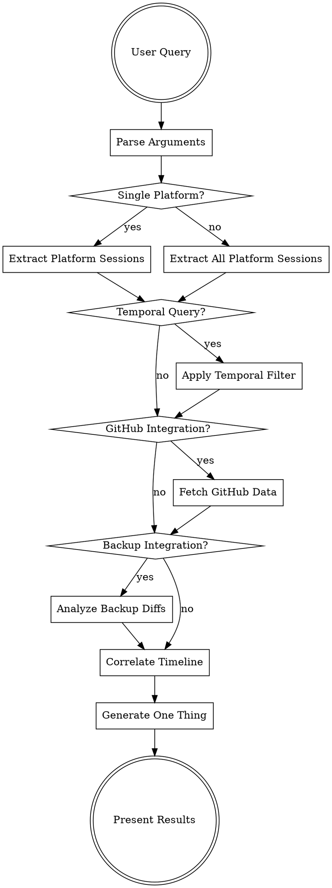

# Multi-Platform Recall Workflow

## Architecture

```
┌─────────────────┐     ┌──────────────────┐     ┌─────────────────┐
│  Claude Code    │     │   Gemini CLI     │     │    Hermes       │
│  JSONL files    │     │   JSON files     │     │   SQLite DB    │
└────────┬────────┘     └────────┬─────────┘     └────────┬────────┘
         │                       │                         │
         └───────────────────────┼─────────────────────────┘
                                 ▼
                    ┌───────────────────────┐
                    │  Normalization Layer  │
                    │  normalized_sessions  │
                    │  (ParsedSession)      │
                    └───────────┬───────────┘
                                ▼
                    ┌───────────────────────┐
                    │   DSPy Correlation    │
                    │   + Heuristic Fallback│
                    └───────────┬───────────┘
                                ▼
                    ┌───────────────────────┐
                    │   GitHub + Restic      │
                    │   Multi-Context        │
                    └───────────────────────┘
```

## Primary Entry Point

**Script:** `scripts/recall_workflow.py`

This orchestrates the complete 4-stage pipeline:

```
STAGE 1: EXTRACTION     → Multi-provider normalized extraction
STAGE 2: CORRELATION    → GitHub + restic integration, timeline build
STAGE 3: SEARCH         → Optional topic search across combined data
STAGE 4: ONE THING      → DSPy synthesis of highest-leverage action
```

## Routing Logic



## Step-by-Step Process

### 1. Argument Parsing

```python
def parse_recall_args(args):
    """Parse recall command arguments into structured request."""
    parsed = {
        'platforms': [],
        'date_range': None,
        'topic': None,
        'github_repo': None,
        'backup_path': None,
        'include_github': False,
        'include_backups': False
    }

    for arg in args:
        if arg.startswith('platform:'):
            parsed['platforms'].append(arg.split(':')[1])
        elif arg.startswith('github:'):
            parsed['github_repo'] = arg.split(':')[1]
            parsed['include_github'] = True
        elif arg.startswith('backup:'):
            parsed['backup_path'] = arg.split(':')[1]
            parsed['include_backups'] = True
        elif arg in ['yesterday', 'today', 'last week', 'this week']:
            parsed['date_range'] = resolve_relative_date(arg)
        elif re.match(r'\d{4}-\d{2}-\d{2}', arg):
            parsed['date_range'] = parse_absolute_date(arg)
        else:
            parsed['topic'] = arg

    # Default to all platforms if none specified
    if not parsed['platforms']:
        parsed['platforms'] = ['claude', 'hermes', 'gemini', 'opencode']

    return parsed
```

### 2. Workflow Orchestration

```python
# Using the new workflow script
python3 scripts/recall_workflow.py --days 7

# With GitHub integration
python3 scripts/recall_workflow.py --days 14 --github-repo owner/repo

# With topic search
python3 scripts/recall_workflow.py --search "authentication" --days 30

# Platform filtering
python3 scripts/recall_workflow.py --platforms claude,hermes --days 7
```

### 3. Normalized Extraction

```python
# Direct access to extraction layer
python3 scripts/normalized_sessions.py extract --days 7 --platforms all

# Output: Unified ParsedSession schema
{
  "claude": [
    {
      "id": "session_abc123",
      "project_path": "/home/user/project",
      "project_name": "project",
      "summary": "Authentication refactor work",
      "generated_title": "OAuth implementation",
      "started_at": "2025-03-25T09:30:00",
      "ended_at": "2025-03-25T11:45:00",
      "message_count": 45,
      "user_message_count": 12,
      "assistant_message_count": 33,
      "tool_call_count": 28,
      "source_tool": "claude",
      "usage": {"input_tokens": 15000, "output_tokens": 8000},
      "messages": [...]
    }
  ],
  "hermes": [...],
  "gemini": [...],
  "opencode": [...]
}
```

### 4. GitHub Integration

```python
def fetch_github_data(repo, date_range):
    """Fetch GitHub commits and PR activity."""
    since = date_range['start'].isoformat() + 'Z'
    until = date_range['end'].isoformat() + 'Z'

    # Get commits
    commits_cmd = f"""
    gh api repos/{repo}/commits \\
      --method GET \\
      --field since="{since}" \\
      --field until="{until}" \\
      --jq '.[] | {{sha: .sha, message: .commit.message, date: .commit.author.date}}'
    """

    commits_result = subprocess.run(commits_cmd, shell=True, capture_output=True, text=True)
    commits = [json.loads(line) for line in commits_result.stdout.strip().split('\n') if line]

    # Get PR activity
    prs_cmd = f"""
    gh pr list --repo {repo} --state all --limit 50 \\
      --json number,title,createdAt,updatedAt,author,state \\
      --jq '.[] | select(.createdAt >= "{since}" or .updatedAt >= "{since}")'
    """

    prs_result = subprocess.run(prs_cmd, shell=True, capture_output=True, text=True)
    prs = [json.loads(line) for line in prs_result.stdout.strip().split('\n') if line]

    return {
        'commits': commits,
        'pull_requests': prs
    }
```

### 5. Backup Diff Analysis

```python
def analyze_backup_diffs(backup_path, date_range):
    """Analyze restic backup diffs for file changes."""
    # Get snapshots in date range
    snapshots_cmd = "restic snapshots --insecure-no-password -r $RESTIC_REPO --json"
    snapshots_result = subprocess.run(snapshots_cmd, shell=True, capture_output=True, text=True)
    snapshots = json.loads(snapshots_result.stdout)

    # Filter snapshots by date range
    relevant_snapshots = []
    for snapshot in snapshots:
        snapshot_time = datetime.fromisoformat(snapshot['time'].replace('Z', '+00:00'))
        if date_range['start'] <= snapshot_time <= date_range['end']:
            relevant_snapshots.append(snapshot)

    # Get diffs between consecutive snapshots
    diffs = []
    for i in range(len(relevant_snapshots) - 1):
        current = relevant_snapshots[i]['id']
        previous = relevant_snapshots[i + 1]['id']

        diff_cmd = f"restic diff {previous} {current} --json"
        diff_result = subprocess.run(diff_cmd, shell=True, capture_output=True, text=True)

        if diff_result.returncode == 0:
            diff_data = json.loads(diff_result.stdout)
            diffs.append({
                'snapshot_id': current,
                'timestamp': relevant_snapshots[i]['time'],
                'changes': diff_data
            })

    return filter_backup_changes(diffs, backup_path)
```

### 6. DSPy Correlation

```python
class TimelineSynthesizer(dspy.Signature):
    """Synthesize coherent narrative from multiple data sources."""
    sessions: List[Dict] = dspy.InputField(desc="List of session data")
    commits: List[Dict] = dspy.InputField(desc="List of git commits")
    file_changes: List[Dict] = dspy.InputField(desc="List of file changes from backup")
    narrative: str = dspy.OutputField(desc="Coherent narrative of activities")
    workstreams: List[str] = dspy.OutputField(desc="Distinct workstreams identified")
    next_actions: List[str] = dspy.OutputField(desc="Suggested next actions")

def correlate_with_dspy(self, timeline: List[Dict]) -> Dict:
    """Use DSPy to correlate and synthesize."""
    if not DSPY_AVAILABLE:
        return self._heuristic_correlation(timeline)
    
    # Extract sessions and commits from timeline
    sessions = [e for e in timeline if e['type'] == 'session']
    commits = [e for e in timeline if e['type'] == 'commit']
    file_changes = [e for e in timeline if e['type'] == 'backup']
    
    # Configure DSPy with LM
    lm = dspy.LM("openai/gpt-4o-mini", api_key=os.environ.get("OPENAI_API_KEY"))
    dspy.configure(lm=lm)
    
    # Run synthesis
    synthesizer = dspy.ChainOfThought(TimelineSynthesizer)
    result = synthesizer(
        sessions=sessions,
        commits=commits,
        file_changes=file_changes
    )
    
    return {
        'narrative': result.narrative,
        'workstreams': result.workstreams,
        'next_actions': result.next_actions
    }
```

### 7. One Thing Generation

```python
class OneThingGenerator(dspy.Signature):
    """Generate the single highest-leverage next action."""
    recent_activity: str = dspy.InputField(desc="Summary of recent work across platforms")
    open_questions: List[str] = dspy.InputField(desc="Unresolved questions or blockers")
    one_thing: str = dspy.OutputField(desc="Single most important next action")
    reasoning: str = dspy.OutputField(desc="Why this action is highest leverage")

def generate_one_thing(timeline, correlation):
    """Generate the single highest-leverage next action."""
    
    # Analyze patterns across timeline
    patterns = analyze_cross_platform_patterns(timeline)
    momentum = calculate_momentum_by_topic(timeline)
    blockers = identify_blockers(timeline)
    
    # Calculate leverage scores
    leverage_scores = {}
    
    for topic, events in patterns.items():
        score = 0
        
        # High momentum topics get priority
        if momentum.get(topic, 0) > 0.5:
            score += 3
        
        # Topics with recent commits get priority
        recent_commits = any(len(e['commits']) > 0 for e in events[-3:])
        if recent_commits:
            score += 2
        
        # Unblocked topics get priority
        if topic not in blockers:
            score += 1
        
        # Topics spanning multiple platforms get priority
        platforms = set(e['platform'] for e in events)
        if len(platforms) > 1:
            score += 2
        
        leverage_scores[topic] = score
    
    # Find highest leverage topic
    top_topic = max(leverage_scores.items(), key=lambda x: x[1])
    
    # Generate specific next action
    latest_events = [e for e in timeline if top_topic[0] in extract_topic(e)][-3:]
    next_action = synthesize_action_from_events(latest_events)
    
    return {
        'topic': top_topic[0],
        'leverage_score': top_topic[1],
        'action': next_action,
        'reasoning': f"Highest momentum topic spanning {len(set(e['platform'] for e in latest_events))} platforms with recent progress"
    }
```

## Output Format

### Summary Table

| Platform | Sessions | Time Range | Key Topics |
|----------|----------|------------|------------|
| Claude Code | 5 | 2025-03-25 to 2025-03-30 | auth refactor, session recall |
| Hermes | 2 | 2025-03-27 to 2025-03-28 | debugging, API integration |
| Gemini CLI | 1 | 2025-03-29 | code review |

### Timeline Correlation

```
2025-03-25 09:30 [Claude] Started auth refactor discussion
2025-03-25 09:45 [GitHub] Commit: "WIP: authentication middleware"
2025-03-25 10:15 [Restic] Modified: src/auth.py, tests/auth_test.py

2025-03-27 14:20 [Hermes] Debugging session timeout issues
2025-03-27 14:35 [GitHub] PR created: "Fix session timeout handling"
2025-03-27 15:00 [Restic] Modified: lib/session_manager.py
```

### One Thing

**Topic**: Authentication refactor (leverage score: 8/10)

**Action**: Complete the session timeout fix from your Hermes debugging session by merging PR #23 and updating the auth middleware tests based on your Claude Code session insights.

**Reasoning**: Highest momentum topic spanning 3 platforms with recent GitHub activity and unblocked path to completion.

## Script Reference

| Script | Purpose | Usage |
|--------|---------|-------|
| `scripts/recall_workflow.py` | Main orchestration | `python3 scripts/recall_workflow.py --days 7` |
| `scripts/normalized_sessions.py` | Extraction + correlation | `python3 scripts/normalized_sessions.py extract --days 7` |
| `scripts/multi-platform-extract.py` | Legacy (deprecated) | Use `normalized_sessions.py` instead |

## Platform-Specific Access

### Claude Code

```bash
# Session files location
~/.claude/projects/<encoded_project_path>/*.jsonl

# Direct parsing
python3 scripts/normalized_sessions.py extract --platforms claude --days 7
```

### Hermes

```bash
# SQLite database location
~/.hermes/state.db

# Direct read-only access (no CLI dependency)
sqlite3 ~/.hermes/state.db "SELECT * FROM sessions WHERE started_at >= datetime('now', '-7 days')"

# Via normalized script
python3 scripts/normalized_sessions.py extract --platforms hermes --days 7
```

### Gemini CLI

```bash
# Session files location (CRITICAL: correct path)
~/.gemini/tmp/<project_hash>/chats/*.json

# NOT: ~/.gemini/antigravity/conversations/ (deprecated)

# Via normalized script
python3 scripts/normalized_sessions.py extract --platforms gemini --days 7
```

### OpenCode

```bash
# SQLite database location
~/.local/share/opencode/opencode.db

# Via normalized script
python3 scripts/normalized_sessions.py extract --platforms opencode --days 7
```
