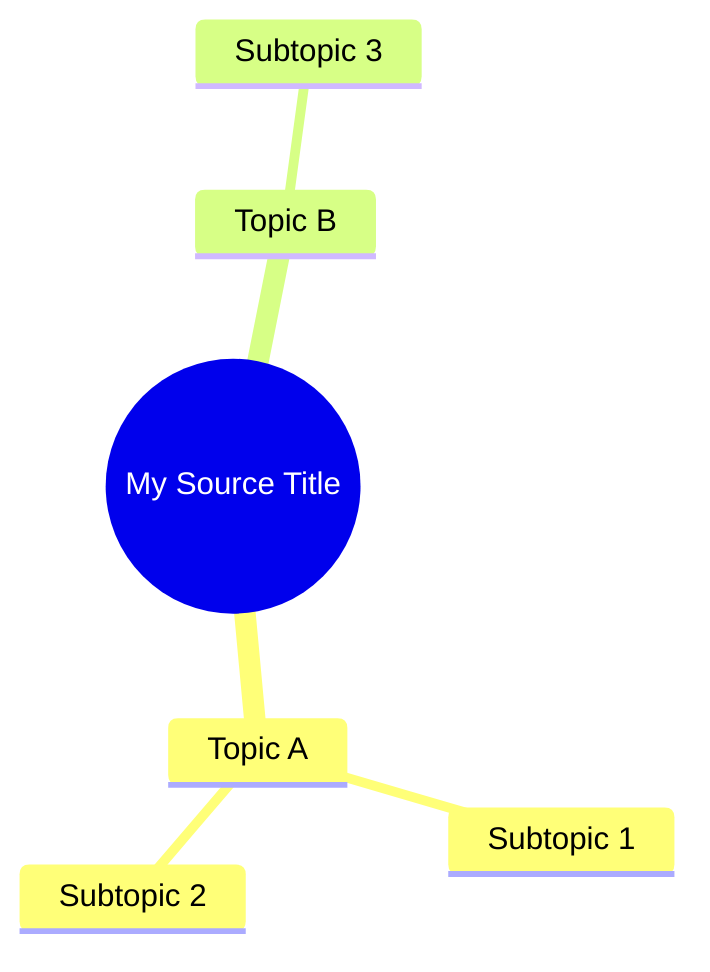

# Import Notebook Workflow

Import all sources from a NotebookLM notebook into the vault as linked `notebook-source` files with AI-generated guides, mind maps (as Mermaid), full source text, plus a dashboard.

## Inputs

- **notebook-slug**: short kebab-case name for the notebook (e.g. `obsidian-x-claude-code`)
- **dashboard-title**: human-readable title for the dashboard (e.g. `Obsidian x AI Harness Research`)

If user doesn't specify these, derive from `notebooklm status` output.

## Step 1: Verify Auth

```bash
notebooklm status
```

If auth error: run `notebooklm login` to re-authenticate.

## Step 2: Get Notebook Info

```bash
notebooklm status
# Note the notebook_id and title
```

## Step 3: Create Folder Structure

```bash
mkdir -p "NotebookLM/{notebook-slug}/Sources"
mkdir -p "NotebookLM/{notebook-slug}/QA"
```

## Step 4: Export Source List

```bash
notebooklm source list --json > /tmp/notebooklm-sources.json
```

Inspect the JSON to understand the schema. Key fields: `id`, `title`, `type`, `url`, `created_at`.

## Step 5: Create Source Files

Run the import script:

```bash
python3 .claude/skills/notebooklm/scripts/import_sources.py \
  --sources /tmp/notebooklm-sources.json \
  --slug {notebook-slug} \
  --dashboard "{dashboard-title}"
```

This creates one `.md` file per source with proper frontmatter and `related` linking to the dashboard.

### What the script fetches per source

| Section | Command used | Notes |
|---------|-------------|-------|
| **Source Guide** | `notebooklm source guide {id} --json` | AI summary + topics + keywords |
| **Mind Map** | `notebooklm source mindmap {id} --json` | Converted to Mermaid mindmap syntax |
| **Full Text** | `notebooklm source fulltext {id} --json` | Full indexed text (PDFs: 35KB+) |

**Fulltext truncation warning:** Plain `notebooklm source fulltext <id>` truncates to ~2KB for terminal display. The script always uses `--json` and extracts `.content` to get the complete text.

For 20 sources, expect 4-6 minutes (three API calls per source).

### Skip flags

```bash
--skip-guides      # Skip AI source guides
--skip-fulltext    # Skip full text download
--skip-mindmap     # Skip mind map fetching
```

## Step 6: Mind Map → Mermaid

Mind maps are automatically converted to Mermaid `mindmap` syntax and embedded in each source file under `## Mind Map`. Example output:

````markdown
## Mind Map


````

If a source has no mind map in NotebookLM, this section is omitted.

## Step 7: Create Dashboard

Create `Dashboards/{dashboard-title}.md` using the dashboard template from `templates/dashboard.md`.

Replace `{notebook-slug}` in the Dataview queries with the actual slug.

## Step 8: Verify

```bash
# Check source count
ls "NotebookLM/{notebook-slug}/Sources/" | wc -l
```

Open the dashboard in Obsidian and verify Dataview queries render.

## Output

Each source file contains:
- Frontmatter: `title`, `type`, `source_id`, `notebook_id`, `url`, `source_type`, `status`, `date`, `topics`, `tags`, `related`
- `## Source Guide` — AI summary and topics
- `## Mind Map` — Mermaid mindmap block (if available)
- `## Full Text` — complete indexed source text (if available)

Plus:
- Dashboard at `Dashboards/{dashboard-title}.md`
- Empty `QA/` folder ready for ask workflow
